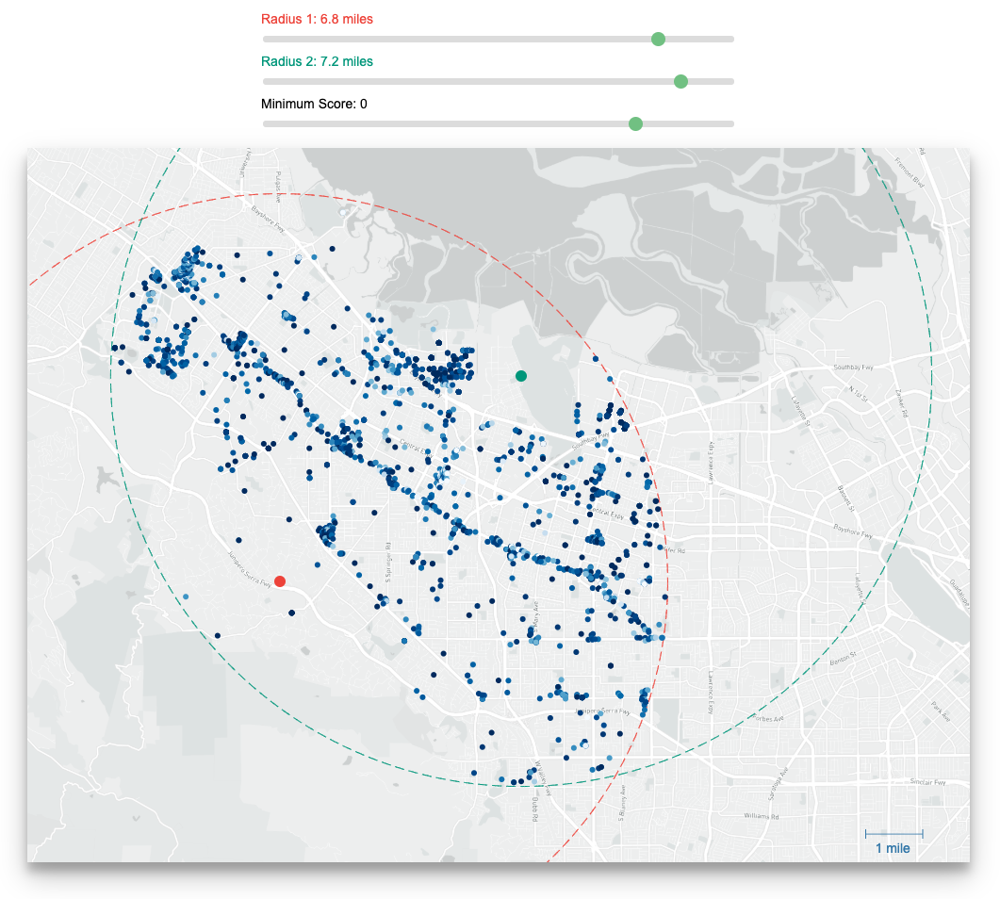

# Restaurant Finder (CS448B Assignment 3)

Using d3.js to visualization restuarants in the South Bay.

For Stanford's CS 448B (Data Visualization class)

## Setup

To run, clone this repository. Then run `python -m http.server` in this directory and go to `localhost:8000` in your web browser.

## Resources Used

These external resources were used for code samples:
1. Calculating distance between two coordinates: [https://www.geodatasource.com/developers/javascript](https://www.geodatasource.com/developers/javascript)
2. Creating the hover tooltip: [https://bl.ocks.org/d3noob/a22c42db65eb00d4e369](https://bl.ocks.org/d3noob/a22c42db65eb00d4e369)
